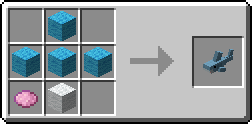
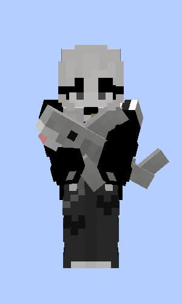
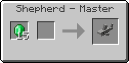
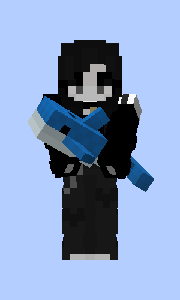
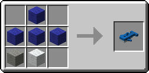
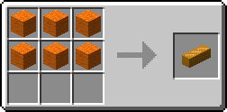
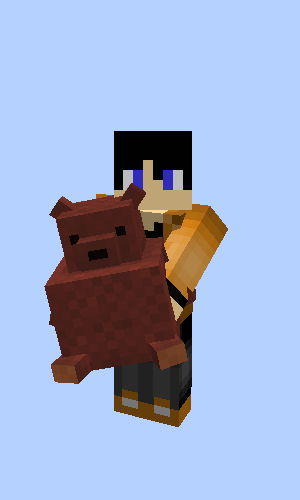
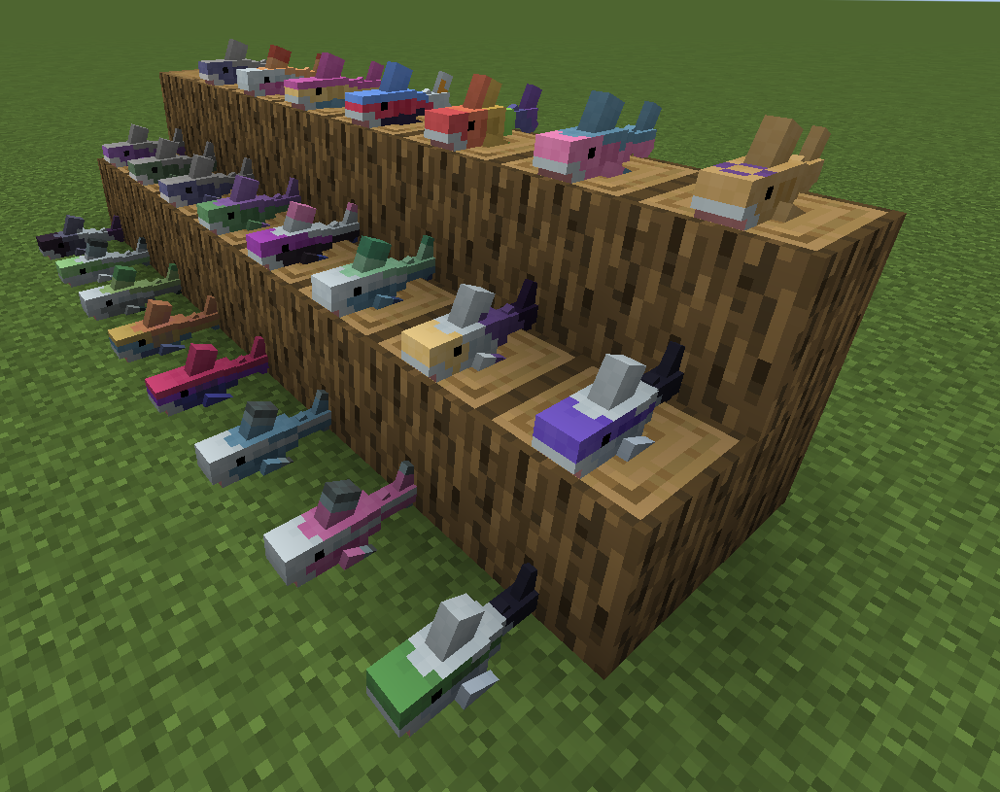

# Blåhaj Paperized

**A minecraft plugin that adds the IKEA BLÅHAJ Soft toy shark and a giant bread pillow as items.**

- When you craft or rename a plushie, it'll have your username attached to it.
- You sadly can't place the plushies down 🥲 (yet)
- Stonecutter recipes also don't work rn ...
- Requires [PaperModAPI](https://modrinth.com/plugin/papermodapi), and semi-optionally [Dynamic RP](https://modrinth.com/plugin/dynamic-rp) and RecipeAPI

## Content

| Item                | Preview                                                         | Recipe                                                                     |
|---------------------|-----------------------------------------------------------------|----------------------------------------------------------------------------|
| Soft Toy Shark      |  |       |
| Gray Toy Shark      |  |   |
| Soft Toy Blue Whale |  |    |
| Bread Pillow        |       |      |
| Brown Bear          |  | Gift from Fletchers, Butchers and Leatherworkers when you rescue a village |
| Pride Sharks        |        |      |

## Ported Mod

This is a port of the fork [Blahaj (Fabric) - replushed](https://github.com/DaFuqs/Blahaj) of the original.
If you are a Quilt user on <=1.20.2 use their version instead and say thanks! 😄

## License

- This plugin - as its original - is licensed under the Unlicense. Feel free to learn from it and incorporate it in your
  own projects.
- The icon of this project is a screenshot of me and a cute Blåhaj.
- Most ingame images are from the original creator Hibiii.
